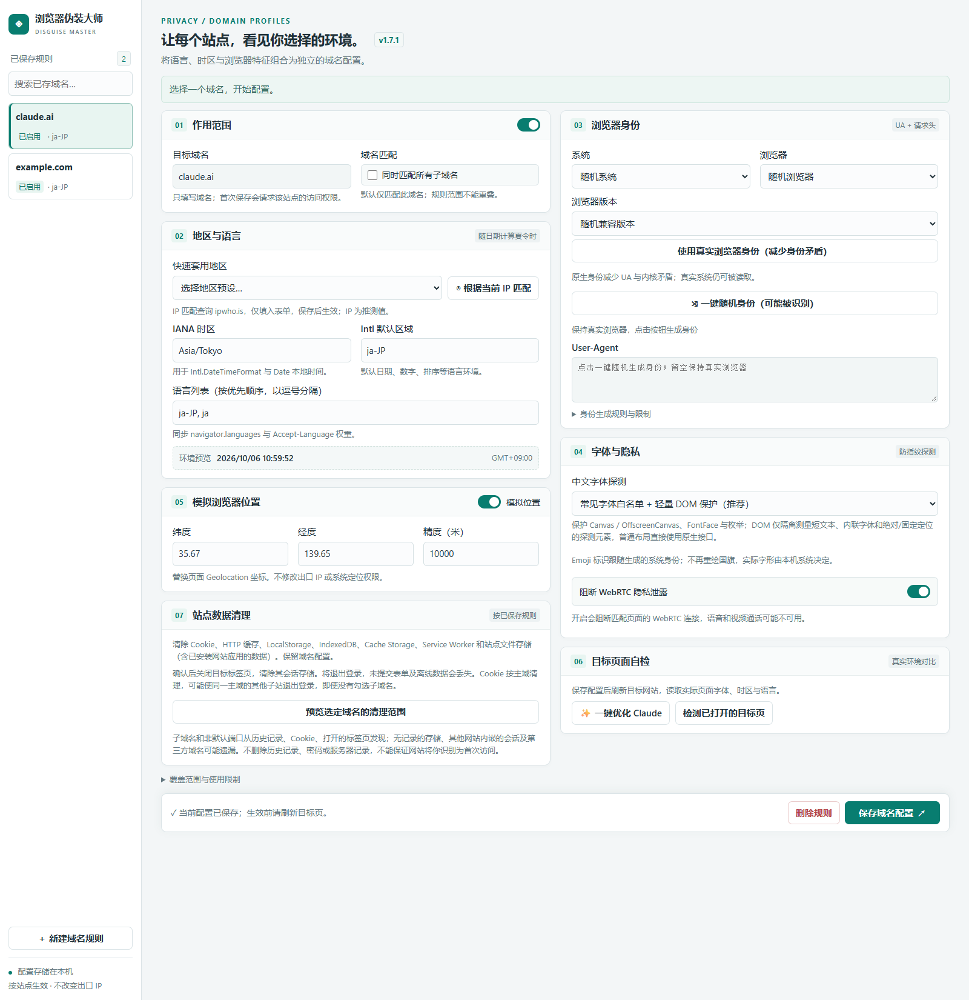

# 浏览器伪装大师

版本 **1.7.1**。基于 Chrome Manifest V3，按域名管理时区、语言、浏览器身份、字体保护、WebRTC 和模拟位置。配置保存在浏览器本地，不修改网络出口 IP。

## 功能特性

| 功能 | 用途 |
| --- | --- |
| 独立域名规则 | 为网站分别保存配置，可包含所有层级子域名；停用规则不注入脚本。 |
| 地区与语言 | 配置 IANA 时区、Intl 默认区域、语言列表与请求头，按日期处理夏令时。 |
| IP 快照匹配 | 主动查询当前出口 IP，匹配大致位置、时区和国家语言预设。 |
| 浏览器身份 | 系统和浏览器分别固定或随机，生成兼容 UA；支持恢复真实身份。 |
| 字体保护 | 选择字体白名单、指定中文字体隐藏或保留原始行为。 |
| WebRTC 控制 | 按站点阻断 WebRTC 连接，可能影响语音和视频通话。 |
| 模拟位置 | 设置网页读取的经纬度与精度，不更改系统定位或实际 IP。 |
| 站点数据清理 | 预览后清理 Cookie、缓存和本地存储，保留域名配置。 |
| 页面自检 | 读取目标页面的字体、时区、语言和平台信息。 |

## 安装和更新

1. 在 Chrome 打开 `chrome://extensions`，开启开发者模式。
2. 点击“加载已解压的扩展程序”，选择本目录（包含 `manifest.json` 的文件夹）。
3. Chrome 138 及以上在扩展详情中开启“允许用户脚本”；Chrome 135–137 使用开发者模式。
4. 将插件固定到浏览器工具栏，点击图标进入设置。

最低支持 Chrome 135。安装无需 Node.js、构建步骤或 API 密钥。
更新本地文件后，点击扩展管理页的重新加载按钮，再重新打开设置并刷新目标网站。

## 快速开始

打开目标网站 → 点击插件图标 → “配置此域名” → 调整设置 → “保存域名配置”并允许站点权限 → 刷新网页。

通过左侧列表切换已有规则，也可以搜索域名或新建规则。修改、停用和删除规则后，都需要刷新已经打开的目标页面。

### 域名范围与开关

只填写域名，不包含路径、端口或通配符。

- `example.com` 默认只匹配自身。
- 勾选“同时匹配所有子域名”后，也匹配 `www.example.com`、`a.b.example.com` 等。
- `www.example.com` 包含子域名时，不会覆盖 `example.com` 或 `api.example.com`。
- 规则范围不能重叠。发生冲突时，编辑现有规则，或取消子域名选项后分别配置。

“作用范围”标题右侧的开关控制规则启用状态。界面省略了重复文字，鼠标悬停和辅助技术仍能识别其用途。
“模拟浏览器位置”开关控制网页位置模拟；WebRTC 行右侧开关开启表示阻断。开关变更需保存。

### 地区、语言和 IP 匹配

可选择地区预设，也可手动填写时区（如 `America/Los_Angeles`）、Intl 区域（如 `en-US`）及按优先级排列的语言（如 `en-US, en`）。模拟位置应与地区设置相协调。

- 工作台“根据当前 IP 匹配”只填入表单，需要核对并保存。
- 弹窗“按当前 IP 更新地区与位置”直接更新当前匹配的已启用规则，并启用模拟位置。

匹配结果保存后固定，不会后台跟踪 IP；换网络或代理后需再次更新。包含子域名的规则更新会影响全部匹配站点。
IP 查询访问 ipwho.is，服务会接收到查询请求及出口 IP。位置只是近似值，语言来自国家预设；分流代理可能使查询服务与目标网站看到不同出口。

### 浏览器身份

选择系统、浏览器及版本策略后，点击“一键随机身份”。固定选项保持不变，只随机允许随机的部分；Safari 仅搭配 macOS。生成的身份保存后固定，不会逐次请求变化。

“随机兼容版本”从模板池选择版本；“优先版本”减少版本变化。部分模板是已发布的历史版本，不代表最新版本。
平台信息自动维护，无需手动填写。

遇到 UA 或浏览器版本不一致提示时，可选择“使用真实浏览器身份”，保存并刷新。此模式保留原生 UA 和 Client Hints，网站也能读取真实浏览器与系统。
Chrome UA 同时包含 Chrome 和 Safari 是兼容格式，不代表运行了两种浏览器。

### 字体、快捷优化与自检

默认字体白名单保护 Canvas / OffscreenCanvas 文本测量、FontFace、字体加载检查及枚举。DOM 保护仅处理短文本（不超过 256 字符）、内联指定字体、绝对或固定定位的叶子元素，使用隔离测量，不改写网页原元素。

普通布局、纯样式表字体、容器、内联固定宽高或变换元素及 `getClientRects` 保留原生行为。这是为降低卡顿而收窄的保护范围，不是完整的 DOM 字体隐藏。

如果某网站仍有卡顿，可以选择“仅隐藏指定中文字体（不处理 DOM 尺寸）”；此模式保留指定中文字体的 Canvas 与字体接口保护，完全不安装 DOM 尺寸拦截。选择“保持原始字体行为”则关闭全部字体保护。修改后保存并刷新网站，比较相同操作。
Emoji 不再额外重绘，实际字形由本机决定。

点击“✨ 一键优化 Claude”后，插件查询当前出口 IP，并一次性填入以下设置：

- 匹配 IP 对应的时区、Intl 区域及国家语言预设。
- 启用模拟位置，填入 IP 的近似经纬度与精度。
- 恢复真实浏览器身份，保留原生 UA 和 Client Hints。
- 启用 WebRTC 阻断、中文字体白名单及轻量 DOM 保护，并启用域名规则。

界面显示 IP、位置及逐项完成清单。**这些改动需要保存，再刷新目标网页才会生效。** 查询失败、权限未授予或地区暂无语言预设时，不会覆盖当前配置。查询期间如果继续编辑表单，本次结果不会覆盖新改动。

优化基于当前 IP，不会强制使用英语或美国时区，也不会修改真实出口 IP。这不是 Claude 官方认证或检测分数保证。

在另一个标签页打开目标网站，保存并刷新后点击“检测已打开的目标页”，查看实际页面环境。自检结果不等于网站总评分。

### 清理站点数据

选择已保存的规则 → 预览清理范围 → 首次授权 → 确认关闭目标标签页并清理 → 完成后重新打开网站。

清理包括 Cookie、HTTP 缓存、LocalStorage、IndexedDB、Cache Storage、Service Worker 和网站文件存储。操作不可撤销，会退出登录，离线数据和未提交表单可能丢失；插件配置保留。

Cookie 清理可能影响同一可注册主域的其他子站。子域名和端口通过历史记录、Cookie、打开的标签页发现，无记录的存储可能遗漏。历史记录只用于发现范围，不上传、不删除。清理不会删除密码或服务器记录，也不能保证成为服务器眼中的新访客。

## 编辑与保存反馈

底部“📝 有未保存的改动”提示会随表单变化更新。点击“丢弃改动”可恢复上次保存或新建时的配置；这不会删除规则。

切换域名或新建规则时，如果有未保存的内容，会提示选择“保存并继续”“丢弃并继续”或“继续编辑”。关闭或刷新页面时，浏览器也会提示未保存的更改。保存失败会保留当前输入；保存期间新做的编辑仍标记为未保存。

保存成功后会显示“✅ 配置已保存并注册”，底部也显示已保存状态。请刷新目标网页，使新设置生效。

## 1.7.1 性能更新

旧版在读取元素尺寸时临时修改真实元素的字体，可能触发强制排版和网站自身的 MutationObserver，形成反复测量。本版做了以下调整：

- 普通元素直接读取原生尺寸，不查询计算样式，也不临时修改字体。
- 字体探测使用按需创建的封闭 Shadow DOM 隔离测量；不再监听整页 DOM 变化。
- 探测结果最多缓存 256 项，文字、内联样式和排版属性参与缓存键；字体加载后清空缓存。
- 配置时区与本机时区相同时，保留原生 Date 构造函数及本地时间读写接口。
- 不同时区下，同一 Date 连续读取年月日时复用转换结果，时间戳变化后重新计算。

已有域名配置和字体模式值保持不变，更新后使用新的轻量实现。**必须在扩展管理页重新加载插件，再刷新已打开的目标网站**，旧页面中的注入代码不会自动替换。

### 验证结果

在隔离的 Chrome 中，对继承中文字体的 150 个普通元素，每轮各重复 5 次读取 `offsetWidth`、`offsetHeight` 和 `getBoundingClientRect`，共运行 3 轮：

| 指标 | v1.7.0 | v1.7.1 |
| --- | ---: | ---: |
| 每轮耗时中位数 | 46.7 ms | 1.3 ms |
| 3 轮期间布局次数 | 2700 | 0 |
| 3 轮期间字体属性变更记录 | 2700 | 0 |

该尺寸读取基准耗时约降低 97%，不代表整站加载、CPU 或内存占用降低同样比例。实际网站的网络请求、脚本和渲染仍会影响流畅度。

同时验证了 Canvas / OffscreenCanvas 字体回退、DOM 探测隔离及文字/字号变化、原元素样式保持、时区和夏令时边界、Date 修改后的缓存失效及不处理 DOM 的字体模式。未对第三方检测网站评分作保证。

## 使用边界

普通扩展无法替换 Chrome 引擎、TLS、GPU 或操作系统字体，也无法保证任意身份不可检测。Worker、未匹配 iframe、部分新窗口及浏览器底层接口不在完整覆盖范围内。字体保护仍有布局开销，不能承诺所有页面无卡顿。

## 本地版本管理

项目使用现有 `.git` 记录本地版本，不要求上传到远程服务。可用 `git log --oneline` 查看历史，`git status --short` 检查未提交改动。

目录保留扩展运行文件、图标、此文档及一张当前界面截图。临时浏览器配置、测试脚本、部署产物和旧截图已清理；`.git` 是版本历史，不能当作无关文件删除。
