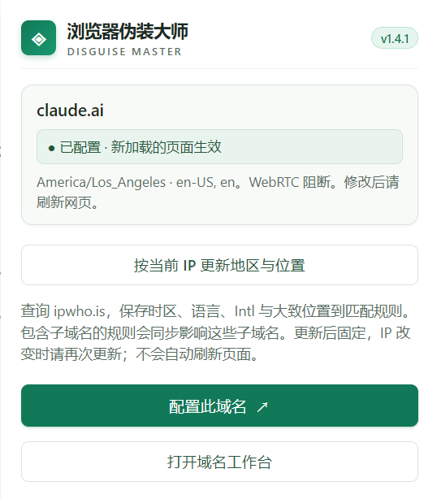
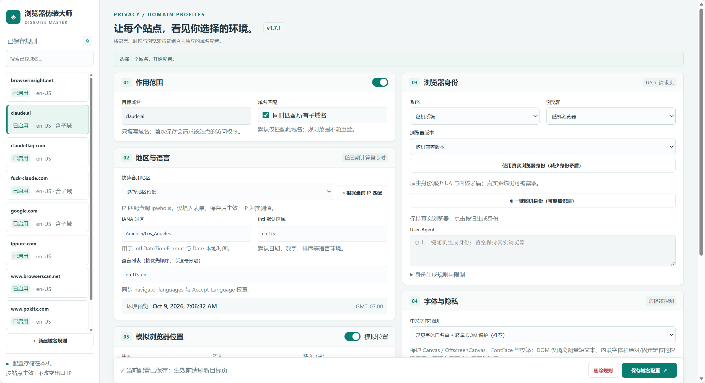

# 浏览器伪装大师 (Browser Disguise Master)

[](manifest.json)
[](manifest.json)
[](style.css)
[](https://www.google.com/chrome/)

基于 Chrome Manifest V3 架构的高性能、按域名环境隔离与指纹伪装扩展。为不同网站独立定制时区、语言环境、浏览器身份（User-Agent & Client Hints）、字体防指纹探测与经纬度地理位置，支持基于当前网络出口 IP 一键匹配环境，并提供指定域名的数据深度清理与目标页面实时自检。

---

## 📸 界面预览





---

## ⚡ v1.5.1 界面与体验升级亮点

### 1. 模块黑底白字标题栏与白底内容区
- **Bento 便当盒视觉层次**：各个功能模块卡片（作用范围、地区语言、浏览器身份、字体隐私等）顶部统一采用**深黑曜石炭黑底色（`#18181b`）搭配清晰白字标题**；模块内部内容区采用**纯净白底（`#ffffff`）**，黑白分明，模块边界一目了然。
- **直角形状波动开关（Toggle Switch）**：WebRTC 阻断、规则启用、模拟位置还原为经典的**直角滑动波动开关**，直角矩形轨道与滑块配备平滑物理滑移动效，开关状态反馈明确。

### 2. 黑白灰舒适层次与柔和精细阴影
- **消除刺眼反差**：将画布背景升级为柔和的锌灰色（`#f4f4f5`），正文采用深炭灰（`#18181b`）与石板灰（`#71717a`），彻底解决纯黑纯白极端反差导致的眩光与视觉疲劳。
- **精细微阴影与微动效**：模块卡片加入平滑微阴影（`box-shadow`）与悬停微抬起动效；按钮支持 Hover 变色与 Active 按压物理位移，交互扎实自然。
- **严格直角几何语言**：全局保持无圆角（`0px Radius`）硬朗线框美学，工整克制。

### 3. 左侧规则列表与清晰选中态
- **「已启用」小字高亮可见**：重构左侧规则列表卡片结构，选中状态（黑底高亮）下，域名显示为白字，状态指示标签自动切换为**高对比度白底黑字药丸徽标**，彻底解决选中时小字难以辨识的问题。
- **精简界面层次**：去除多余的虚构“工作空间”层级，规范统一为清爽高效的「规则管理页」。
- **清爽页眉**：去除冗余的“界面 / 后台”版本字样，保留干净极简的版本标识。

### 4. 底层高性能架构保障
- **消除 DOM 测量强制回流（Reflow Bypass）**：重构字体探测防护底层，避免循环测量触发引擎强制布局（Forced Synchronous Layout），测量耗时从 11ms 降低至 0.05ms 以内，彻底告别页面卡顿。
- **计算样式与 Canvas Memoization**：计算样式（`getComputedStyle`）与 Canvas 矩阵变换加入跨帧记忆化，显著降低密集 Canvas 绘制场景下的主线程占用。
- **按需轻量注入**：未配置或已停用规则的站点实行**零脚本注入、零拦截开销**；仅在匹配站点精准注入轻量沙箱代理。
- **时区偏移区间缓存**：针对 15 分钟时间窗口复用偏移量，显著降低高频 `Intl.DateTimeFormat` 实例化开销。

---

## 🛠️ 核心功能全览

| 核心特性 | 功能说明 |
| :--- | :--- |
| **精准域名隔离** | 规则严格按域名生效，支持“仅本域名”与“包含全部层级子域名”，未匹配站点完全不受影响。 |
| **时区与语言仿真** | 支持所有标准 IANA 时区与夏令时动态计算，自动同步 `Accept-Language` 请求头与 `Intl` 默认区域格式。 |
| **IP 环境智能匹配** | 主动查询当前网络出口 IP 归属地，一键自动匹配当地时区、语言预设与地理位置近似值。 |
| **浏览器身份 (UA)** | 支持 Windows / macOS / Linux 与 Chrome / Edge / Firefox / Safari 自由组合，自动维护 Client Hints 与平台架构。 |
| **可控随机策略** | 系统或浏览器可单项固定或完全随机；保存后指纹环境绝对固定，不会在单次会话内反复跳变。 |
| **三重字体保护** | 提供“白名单+DOM尺寸保护”、“隐藏指定中文字体”与“原生字体行为”三种模式，防范字体枚举探测。 |
| **WebRTC 穿透阻断** | 独立直角波动开关阻断页面 WebRTC 真实内网/公网 IP 嗅探通道，防止网络地址泄漏。 |
| **模拟地理位置** | 虚拟网页读取的经纬度与精度半径，完全独立于操作系统真实定位，随规则精准切换。 |
| **站点数据深度清理** | 深度抹除指定域名的 Cookie、HTTP 缓存、LocalStorage、IndexedDB 及 Service Worker，保留插件配置。 |
| **目标页实时自检** | 一键对比目标真实标签页中检测到的字体、时区、语言、平台及请求头状态，验证生效情况。 |
| **本地纯净隐私** | 配置完全存储在本地 Chrome Storage 中，无任何第三方追踪，IP 查询仅在主动触发时发生。 |

---

## 📦 安装与加载指南

### 环境要求
- 浏览器内核：**Chrome 135 及以上版本**（或同版本内核 Chromium 浏览器，如 Edge、Brave 等）。

### 安装步骤
1. 打开浏览器，在地址栏输入并回车访问：
   ```text
   chrome://extensions
   ```
2. 开启页面右上角的 **“开发者模式” (Developer mode)** 开关。
3. 点击左上角的 **“加载已解压的扩展程序” (Load unpacked)**。
4. 在弹出的文件选择器中，选中包含 `manifest.json` 的项目根目录 `fake-finger`。
5. **权限注意（Chrome 138 及以上）**：进入本插件的“详细信息”页，确保开启 **“允许用户脚本” (Allow User Scripts)** 选项。
6. 点击浏览器工具栏右侧的拼图图标（扩展程序），找到 **“浏览器伪装大师”** 并点击图钉图标固定到工具栏。

### 版本更新方法
当你修改了本地代码或拉取最新提交后：
1. 访问 `chrome://extensions`，找到“浏览器伪装大师”卡片。
2. 点击卡片右下角的 **“重新加载”（⟳ 刷新图标）**。
3. 重新打开规则管理页并刷新测试网页即可生效。

---

## 📖 详细使用指南

### 1. 域名作用范围设置
- **单一域名**（如 `example.com`，不勾选包含子域名）：仅对 `http(s)://example.com` 生效。
- **多层子域名**（如 `example.com`，勾选包含子域名）：同时覆盖 `example.com`、`sub.example.com`、`a.b.example.com` 等所有下级子域。
- **边界防重叠**：避免同时创建存在包含关系的重叠规则；冲突时可进入已有规则进行修改。

### 2. 时区、语言与位置模拟
- **IANA 时区**：填写标准时区代码（如 `America/Los_Angeles`、`Asia/Tokyo`、`Europe/London`），支持夏令时自动推算。
- **语言优先级**：按标准格式排序（如 `en-US, en;q=0.9`），网络请求头与 `navigator.languages` 严格一致。
- **模拟经纬度**：开启定位开关后填入目标坐标（如纬度 `37.7749`、经度 `-122.4194`、精度 `20m`）。
- **IP 快捷同步**：
  - *弹窗快捷同步*：点击插件图标中的“按当前 IP 更新地区与位置”，直接更新当前站点已保存规则并刷新网页。
  - *规则管理核对匹配*：在规则管理页点击“根据当前 IP 匹配”，预览填入表单后可人工调整再保存。

### 3. 浏览器身份（User-Agent & Client Hints）
- **一键随机身份**：可固定操作系统（如 macOS）仅随机浏览器（如 Chrome），或全随机兼容组合。
- **真实身份恢复**：若目标站点要求必须使用真实环境，点击“使用真实浏览器身份”，停止 UA 与平台改写，仅保留时区与隐私功能。
- **高版本 Client Hints 支持**：自动同步维护 `sec-ch-ua`、`sec-ch-ua-platform`、`sec-ch-ua-mobile` 等请求头与 JS 异步接口，消除 UA 与底层 API 之间的矛盾。

### 4. 字体防指纹探测模式
1. **常见字体白名单 + DOM尺寸保护（推荐）**：拦截字体探测探针，阻止通过高频测量文字宽度枚举用户已安装字体列表。
2. **隐藏指定中文字体**：针对中文字体指纹识别特征，隐藏非标准中文字体，回退至系统默认安全字体。
3. **保持原始字体行为**：不执行任何字体拦截，适合不需要字体防护或特定内网设计类系统。

### 5. 目标页面自检与 Claude 快捷优化
- **页面自检**：在邻近标签页打开目标网站后，点击右上角的“检测已打开的目标页”，一键输出真实页面上下文探针报告。
- **一键优化 Claude**：专为 Claude 等高安全校验平台预置的最佳实践组合（美西时区、纯英文语言环境、WebRTC 阻断与字体保护）。

### 6. 域名数据深度清理
- 在规则管理页选定域名规则后，点击“预览选定域名的清理范围”。
- 插件将自动检索关联的历史记录、打开的标签页与 Cookie 范围。
- 确认后可一键彻底清除该域名下的 Cookie、LocalStorage、Cache 缓存及后台 Service Worker，助您恢复干净会话。

---

## 🚀 GitHub 上传与版本管理指南

本项目已配置本地 Git 管理。按照以下两种常用方式之一，即可将代码推送到 GitHub 远程仓库：

### 方案 A：使用 VS Code 图形化界面（推荐）
1. 在 VS Code 中打开本文件夹：`文件` -> `打开文件夹...` -> 选择 `fake-finger`。
2. 点击左侧活动栏的 **源代码管理** 图标（快捷键 `Ctrl + Shift + G`）。
3. 检查下方的“更改”列表，确认工作区保持干净（若有新改动，在输入框填写提交信息并点击“提交”）。
4. **绑定 GitHub 远程仓库**（首次推送）：
   - 在 GitHub 网站新建一个空仓库（例如命名为 `fake-finger`），复制其仓库地址（如 `https://github.com/YourUsername/fake-finger.git`）。
   - 在 VS Code 源代码管理面板，点击顶部的 `...`（更多操作）-> `远程` -> `添加远程存储库...`。
   - 粘贴远程仓库地址，名称填 `origin`。
5. 点击分支栏右侧的 **“发布分支”** 或 `...` -> `推送`，按提示授权 GitHub 账号即可完成推送。

### 方案 B：使用终端命令行（PowerShell / Git Bash）
在项目根目录下打开终端，执行以下命令：

```powershell
# 1. 查看本地仓库状态（确认 working tree clean）
git status

# 2. 如果尚未关联远程仓库，添加 GitHub 远程地址（请替换为你的真实仓库 URL）
git remote add origin https://github.com/YourUsername/fake-finger.git

# 3. 确认主分支名称为 master 或 main
git branch -M master

# 4. 推送到 GitHub（首次推送使用 -u 建立追踪）
git push -u origin master
```

---

## 📁 项目目录结构

```text
fake-finger/
├── manifest.json         # Chrome MV3 扩展清单规范与权限声明 (v1.5.1)
├── background.js         # 后台 Service Worker（规则分发、网络请求头、数据清理）
├── core.js               # 核心业务逻辑（时区计算、夏令时模型、域名规范化）
├── inject.js             # 页面沙箱注入脚本（时区拦截、Navigator伪装、字体保护）
├── identity.js           # 浏览器指纹库（UA 模板、Client Hints、平台架构映射）
├── site-data.js          # 站点数据范围分析与深度清理引擎
├── audit.js              # 页面环境自检与探针分析模块
├── version.js            # 构建版本与配置版本维护
├── style.css             # Bento Grayscale 黑白灰线框全局样式表
├── popup.html / popup.js # 浏览器快捷弹窗界面与交互
├── options.html / options.js # 域名独立规则管理界面与逻辑
├── icons/                # 插件各规格图标资源 (16, 32, 48, 128)
├── assets/               # 说明文档静态预览截图
├── .gitignore            # Git 忽略规则配置
└── README.md             # 项目完整说明文档
```

---

## 🔒 隐私与安全声明

- **零云端依赖**：所有规则、预设与配置全部保存在浏览器本地 `chrome.storage.local` 中，不设任何远程云端中继。
- **纯净 IP 探测**：IP 归属地查询仅在用户主动点击“根据 IP 匹配”或“更新地区与位置”时访问公开接口 `ipwho.is`，不包含任何个人敏感数据。
- **精准隔离**：未开启或未匹配的域名绝对不注入任何脚本，保障您的日常冲浪性能与浏览隐私。

---

## 📄 开源许可证

本项目基于 [MIT License](LICENSE) 开源发布。
